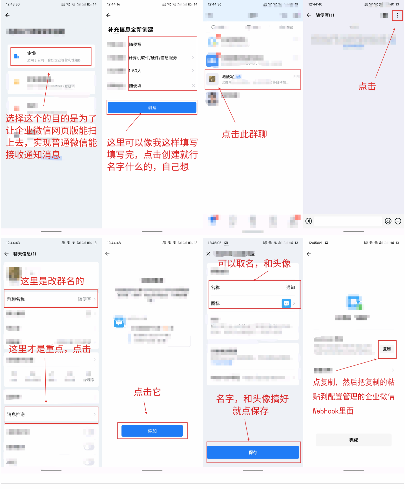
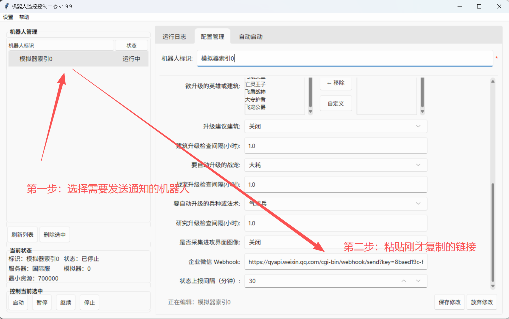
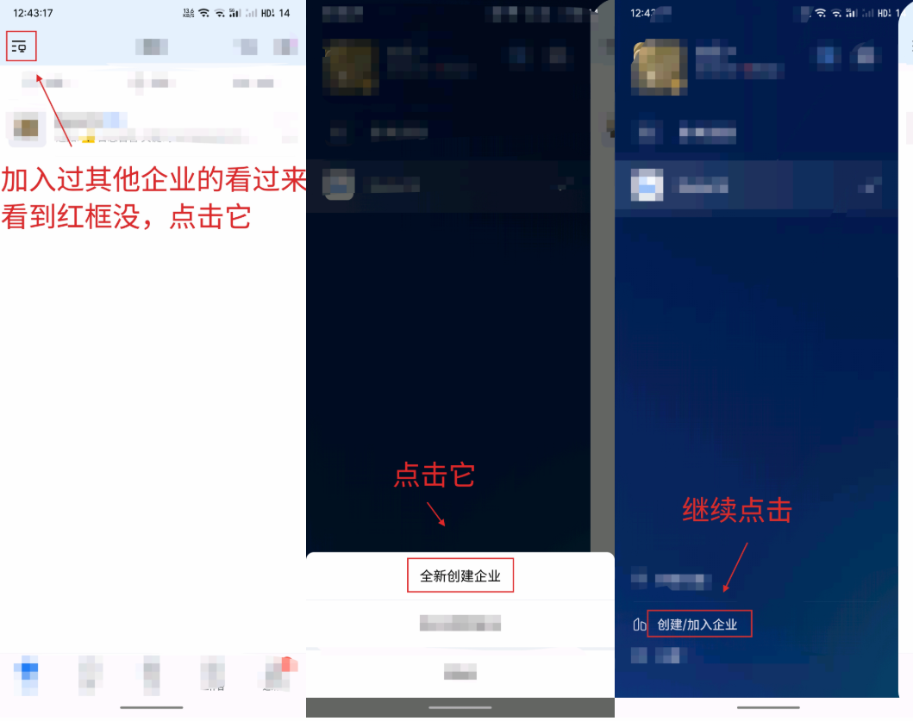
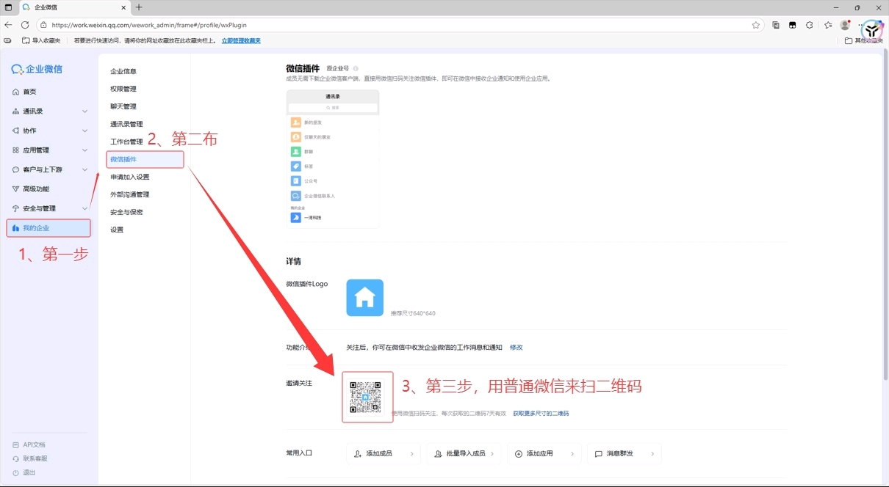

# 企业微信通知配置指南

## 功能介绍

企业微信通知功能可以让你实时监控机器人的运行状态，无论你在哪里，都能通过手机企业微信接收机器人的状态推送。

### 📱 通知内容

机器人会在以下时机自动发送通知到企业微信群：

| 通知类型 | 触发时机 | 内容 |
|---------|---------|------|
| ✅ **启动通知** | 机器人启动时 | 机器人标志、启动时间、当前截图 |
| ⛔ **停止通知** | 机器人停止时 | 机器人标志、停止原因、停止时间、当前截图 |
| ⚠️ **异常通知** | 任务出现异常时 | 机器人标志、任务名称、异常信息、当前截图 |
| 📊 **定时上报** | 按配置间隔定时发送 | 机器人标志、当前时间、当前截图 |

每条通知都会包含当前模拟器的实时截图，方便你直观了解机器人状态。

---

## 配置步骤

### 前置说明

**重要**：企业微信通知有两种接收方式：

| 方式 | 说明 | 适用场景 |
|------|------|---------|
| **仅企业微信接收** | 只在企业微信 APP 中接收通知 | 你已经在使用企业微信 |
| **企业微信 + 普通微信接收** | 同时在企业微信和普通微信中接收通知 | 你想在常用的微信中收到通知 |

💡 **推荐**：选择"企业微信 + 普通微信接收"，这样你的手机微信就能收到通知，更方便。

---

## 快速配置指南（图文版）

### 📱 一图流配置步骤

**步骤 1：创建企业**



步骤 2：设置Webhook URL



⚠️ **注意**：如果你之前加入过其他企业，需要创建一个新的企业。



💡 **提示**：点击"新用户注册"可以返回到初始注册页面。

---

**步骤 3：（可选）在普通微信中接收通知**

如果你想在常用的微信中也收到通知：

1. 电脑打开 [企业微信网页版后台](https://work.weixin.qq.com/wework_admin/frame#/profile/wxPlugin)
2. 用企业微信 APP 扫码登录
3. 选择你刚创建的企业



✅ **配置完成后**：
- 只想用普通微信的用户：可以卸载企业微信 APP
- 企业微信用户：可以切回你工作用的企业
- **如果你想多个机器人配置不同的机器人，那么可以在创建的企业微信中邀请几个人创建群聊，然后创建机器人，将多余的人踢出群聊即可**

---

## 详细配置步骤（文字版）

### 第一步：注册企业微信（必须）

> ⚠️ 即使你只想在普通微信接收消息，也**必须**先注册企业微信。#### 1.1 下载企业微信

在手机应用商店搜索"**企业微信**"并下载安装（iOS / Android 均可）。

#### 1.2 创建企业

打开企业微信 APP：

1. 选择 **"企业注册"** 或 **"创建企业"**
2. 按提示填写信息：
   - **企业名称**：随便填（如"我的个人工作室"）
   - **行业类型**：随便选
   - **你的姓名**：填真实姓名
   - **手机号**：填你的手机号（用于接收验证码）
3. 完成手机验证
4. **选择账号类型**：
   - ⚠️ **重要**：如果你想在普通微信也接收通知，必须选择 **"企业"**
   - 如果只想在企业微信接收，可以随意选择
5. 创建完成

> 💡 **提示**：
> - 注册企业微信是**免费**的，不需要营业执照
> - 选择"企业"类型后，可以关联普通微信接收通知
> - 一个人可以创建多个企业

---

### 第二步：创建群机器人

#### 2.1 创建内部群

在企业微信中：

1. 点击底部 **"通讯录"** → 点击右上角 **"+"**
2. 选择 **"创建群聊"**
3. 选择 **"内部群"**（不是"外部群"）
4. 群名称建议设置为 **"COC机器人监控"**
5. 添加成员：**只加你自己即可**（一个人的群也可以）
6. 创建完成

> ⚠️ **注意**：必须是"内部群"，外部群无法添加群机器人。

#### 2.2 添加群机器人

在刚创建的群聊中：

1. 点击右上角 **"···"** → **"群设置"**
2. 向下滚动，找到 **"群机器人"**
3. 点击 **"添加群机器人"**
4. 设置机器人信息：
   - **名称**：如"COC通知机器人"
   - **头像**：可选，随意设置
5. 点击 **"添加"**

#### 2.3 获取 Webhook URL

添加成功后，会显示一个 **Webhook 地址**，格式类似：

```
https://qyapi.weixin.qq.com/cgi-bin/webhook/send?key=xxxxxxxx-xxxx-xxxx-xxxx-xxxxxxxxxxxx
```

**⚠️ 重要**：
- 点击 **"复制"** 按钮，完整复制这个 URL
- 这个 URL 是机器人的唯一标识，请妥善保管
- 任何拥有此 URL 的人都可以向你的群发消息
- 建议不要公开分享此 URL


---

### 第三步：（可选）关联普通微信接收通知

> 💡 如果你只想在企业微信接收通知，可以跳过此步骤。

#### 3.1 登录企业微信管理后台

在电脑浏览器中：

1. 访问：https://work.weixin.qq.com/
2. 使用企业微信 APP **扫码登录**（管理员身份）

#### 3.2 配置应用可见范围

1. 进入管理后台后，点击左侧 **"应用管理"**
2. 找到 **"群机器人"** 应用并点击进入
3. 在 **"可见范围"** 中，确保添加了你自己
4. 保存设置

#### 3.3 在普通微信中接收通知

1. 打开手机**普通微信**（不是企业微信）
2. 在"通讯录"中找到 **"企业微信联系人"**
3. 找到你创建的企业
4. 进入后可以看到群聊，通知会同步到这里

> 💡 **效果**：
> - 机器人发送的通知会同时出现在：
>   - 企业微信 APP 的群聊中
>   - 普通微信的"企业微信联系人"中
> - 你可以在常用的微信中直接查看通知

---

### 第四步：配置 COC Robot

#### 4.1 打开机器人配置界面

1. 启动 `coc_robot` 主程序
2. 选择要配置的机器人
3. 点击 `设置` 按钮

#### 4.2 填写 Webhook URL

在配置界面中找到以下两个选项：

| 配置项 | 说明 | 示例值 |
|-------|------|--------|
| **企业微信 Webhook** | 粘贴你在第二步获取的 Webhook URL | `https://qyapi.weixin.qq.com/cgi-bin/webhook/send?key=xxx` |
| **状态上报间隔（分钟）** | 定时上报的时间间隔，0 表示禁用定时上报 | `30`（默认30分钟） |


#### 4.3 保存配置

点击 `保存` 按钮，配置立即生效。

---

### 第五步：测试通知

#### 5.1 启动机器人

点击 `启动` 按钮，如果配置正确，你应该会收到一条启动通知：

**企业微信/普通微信中显示**：
```
[机器人标志]
✅ 机器人已启动
时间: 2026-06-06 14:30:00
```

紧接着会收到一张当前模拟器的截图。

> 💡 **提示**：
> - 如果配置了"关联普通微信"，你的手机微信会同时收到通知
> - 可以在"通讯录 → 企业微信联系人"中查看

#### 5.2 测试停止通知

点击 `停止` 按钮，你应该会收到停止通知：

```
[机器人标志]
⛔ 机器人已停止
原因: 手动停止
时间: 2026-06-06 14:35:00
```

同样会附带一张截图。

---

## 配置完成！✅

现在你可以：
- ✅ 在企业微信中接收通知
- ✅（可选）在普通微信中同步接收通知
- ✅ 远程监控机器人状态，无需盯着电脑

---

## 高级配置

### 定时上报间隔设置

**状态上报间隔（分钟）** 控制定时上报的频率：

| 设置值 | 行为 | 适用场景 |
|-------|------|---------|
| `0` | 禁用定时上报 | 只想接收启动/停止/异常通知 |
| `5-10` | 高频上报 | 测试阶段，想密切监控 |
| `30` | 推荐值 | 日常使用，平衡监控需求和消息频率 |
| `60-120` | 低频上报 | 长期稳定运行，减少打扰 |

**⚠️ 注意**：
- 定时上报会在机器人运行期间按间隔自动发送
- 每次上报都会发送文字 + 截图，请根据实际需求设置间隔
- 间隔太短可能导致群消息过多

### 多机器人配置

如果你运行多个机器人，可以：

1. **方案1：所有机器人使用同一个 Webhook**
   - 所有通知发送到同一个群
   - 通过机器人标志区分不同机器人

2. **方案2：每个机器人使用独立 Webhook**
   - 为每个机器人创建独立的企业微信群
   - 每个群只接收对应机器人的通知
   - 更清晰，但需要管理多个群

---

## 常见问题

### Q1: 配置了 Webhook 但收不到通知？

**检查清单**：
1. ✅ Webhook URL 是否完整复制（不要漏掉 `key=` 后面的部分）
2. ✅ 机器人是否已启动（只有运行中才会发送通知）
3. ✅ 企业微信群机器人是否被删除或停用
4. ✅ 网络连接是否正常（需要能访问企业微信 API）
5. ✅ 查看机器人日志是否有 "企业微信通知发送失败" 的错误

### Q2: 收到通知但没有截图？

**可能原因**：
- 截图获取失败（模拟器未启动或窗口被遮挡）
- 图片过大被企业微信 API 拒绝（目前使用 JPEG 80% 质量压缩，一般不会超限）

**解决方法**：
- 确保模拟器窗口可见（不要最小化）
- 查看日志中是否有 "截图发送失败" 的提示

### Q3: 定时上报不工作？

**检查清单**：
1. ✅ 状态上报间隔是否设置为 0（0 表示禁用）
2. ✅ 机器人是否在持续运行（暂停状态不会上报）
3. ✅ 间隔时间是否已到（如设置30分钟，需要等待30分钟后第一次上报）

### Q4: 消息频率太高，影响使用？

**解决方法**：
- 调大 **状态上报间隔**（如从30分钟改为60分钟）
- 设置为 0 完全禁用定时上报
- 将异常通知的机器人单独放到一个群，日常监控群只开启少数机器人

### Q5: 企业微信 API 返回错误？

**常见错误码**：

| 错误码 | 含义 | 解决方法 |
|-------|------|---------|
| `93000` | Webhook 地址无效 | 检查 URL 是否完整 |
| `45009` | 发送频率过高 | 降低上报频率，企业微信限制每分钟最多20条 |
| `40013` | 图片过大 | 联系开发者，可能需要进一步压缩 |

### Q6: 可以自定义通知内容吗？

**目前支持**：
- 通知内容格式是固定的（机器人标志 + 状态文本 + 时间 + 截图）

**开发者可以修改**：
- 编辑 `工具包/企业微信通知.py` 自定义通知格式
- 编辑 `任务流程/基础任务框架.py` 修改通知触发时机

---

## 技术细节

### 实现原理

企业微信通知功能基于以下技术实现：

1. **异步发送**：使用线程池异步发送消息，不阻塞机器人主流程
2. **智能延时**：集成在 `脚本延时()` 方法中，自动检测上报时机
3. **频率控制**：最多每秒检查一次，避免短延时导致的过度检查
4. **失败容错**：通知发送失败不影响机器人运行

### API 限制

企业微信群机器人 API 限制：
- 每个机器人每分钟最多发送 **20 条消息**
- 图片大小最大 **2MB**（本项目使用 JPEG 80% 压缩，一般不会超限）
- 文本内容最长 **2048 字节**

### 安全建议

1. **不要公开 Webhook URL**：任何人拿到此 URL 都可以向你的群发消息
2. **定期更换 Webhook**：如果怀疑 URL 泄露，删除旧机器人并创建新的
3. **谨慎分享截图**：截图可能包含游戏账号信息

---

## 参考资料

- [企业微信群机器人官方文档](https://developer.work.weixin.qq.com/document/path/91770)
- [本项目开发文档](../开发指南/00-项目设计思路.md)

---

**最后更新时间**：2026-06-06
